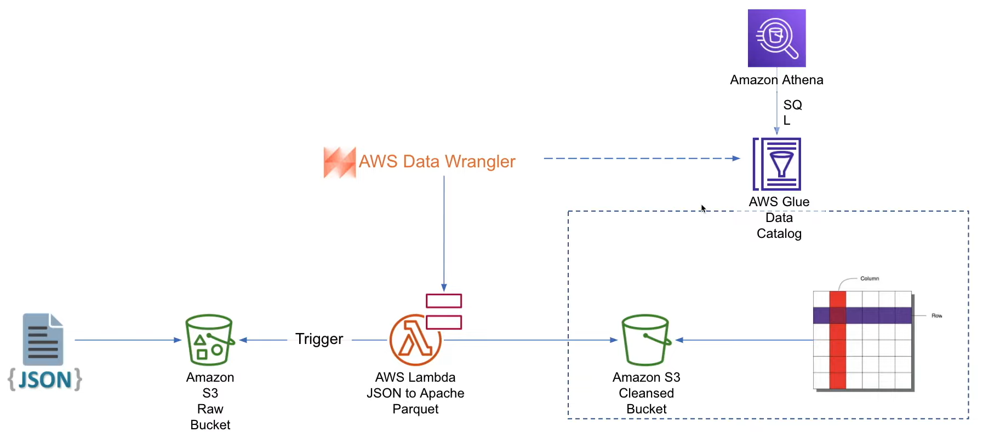

# youtube-data-analysis

### Main goal

The main goal was to launch a data-driven campaign.

### Subgoals

1. Design and build a new Data Lake architecture
2. Create ETL design and data pipelines for efficient data processing
3. Create a BI tier and build a dashboard
4. Build entire infrastructure in AWS


### Main advertising channel

YouTube was selected as the main advertising channel.

#### Why Youtube?

YouTube is the second most visited website in the entire world.&#x20;

<figure><figcaption><p><a href="https://www.visualcapitalist.com/the-50-most-visited-websites-in-the-world/">https://www.visualcapitalist.com/the-50-most-visited-websites-in-the-world/</a></p></figcaption></figure>

### Initial questions to answer:&#x20;

* How to categorize videos, based on their comments and statistics.
* What factors affect how popular a YouTube video will be.

### Used dataset

 The dataset was taken from here:&#x20;

[https://www.kaggle.com/datasets/datasnaek/youtube-new](https://www.kaggle.com/datasets/datasnaek/youtube-new)&#x20;

For future development there is an option to take this one that updates daily:

[https://www.kaggle.com/datasets/rsrishav/youtube-trending-video-dataset](https://www.kaggle.com/datasets/rsrishav/youtube-trending-video-dataset)

### The architecture of the project

<figure><figcaption><p>Data Flow diagram</p></figcaption></figure>


### Data Lake

The project required to create of three s3 buckets.

#### Landing area

Landing area - is a bucket for raw data from the dataset.

#### Cleansed/Enriched&#x20;

Cleansed/Enriched - bucket for cleansed data after processing through the "Data processing" layer.

#### Analytics/Reporting

Analytics/Reporting  - is a bucket for data that is ready for the BI process.

### My development process:

First of all, an IAM user with the required permissions has been created. All further actions were made from this user account.


Then "Landing Area" s3 bucket needs to be created. \
The dataset was previously downloaded and saved in the project folder. This data then had to be copied to the s3 bucket. To do this, I ran the following commands:

```shell
cd /.../data_directory

# Copy all .json files in directory to the selected path of the bucket
aws s3 cp . s3://<bucket_name>/youtube/raw_statistics_reference_data/ \
    --recursive --exclude "*" --include "*.json" 

# Copy each .csv file in separate folder
aws s3 cp CAvideos.csv s3://<bucket_name>/youtube/raw_statistics/region=ca/
aws s3 cp DEvideos.csv s3://<bucket_name>/youtube/raw_statistics/region=de/
aws s3 cp FRvideos.csv s3://<bucket_name>/youtube/raw_statistics/region=fr/
aws s3 cp GBvideos.csv s3://<bucket_name>/youtube/raw_statistics/region=gb/
aws s3 cp INvideos.csv s3://<bucket_name>/youtube/raw_statistics/region=in/
aws s3 cp JPvideos.csv s3://<bucket_name>/youtube/raw_statistics/region=jp/
aws s3 cp KRvideos.csv s3://<bucket_name>/youtube/raw_statistics/region=kr/
aws s3 cp MXvideos.csv s3://<bucket_name>/youtube/raw_statistics/region=mx/
aws s3 cp RUvideos.csv s3://<bucket_name>/youtube/raw_statistics/region=ru/
aws s3 cp USvideos.csv s3://<bucket_name>/youtube/raw_statistics/region=us/
```

After this step, I needed to set up AWS Glue.

1. A database "youtube\_data\_analysis\_raw" in Glue was created
2. A crawler "...-youtube-data-analysis-raw-glue-1" was created with next settings:
   1. As data source i choose s3 bucket path to .json files: s3://\<bucket\_name>/youtube/raw\_statistics\_reference\_data/
   2. A new security group for crawler with required permissions was created and selected
   3. A new Glue DB was selected for output
3.  &#x20;Crawler created a new table with the next schema:

    ```json
    [ 
        { "Name": "kind", "Type": "string" }, 
        { "Name": "etag", "Type": "string" }, 
        { 
            "Name": "items", 
            "Type": "array<struct<kind:string,etag:string,id:string,snippet:struct<channelId:string,title:string,assignable:boolean>>>" 
        } 
    ]
    ```
4.  After that, I noticed that files .json in the dataset have this structure:

    ```json
    {
     "kind": "string",
     "etag": "string",
     "items": [
      {
       "kind": "string",
       "etag": "string",
       "id": "int",
       "snippet": {
        "channelId": "string",
        "title": "string",
        "assignable": "Boolean"
       }
      },
      {
      ...
       },
       {
       ...
       }
      },
    ```
5. So I decided to process data through AWS lambda to get .parquet files instead of JSON

I needed to build a pipeline that will cleanse data from a semi-structured to a structured form.

<figure><figcaption><p>Data pipeline diagram</p></figcaption></figure>

To do this a Lambda function was created with next properties:

1. Name - youtube-data-analysis-lambda-json-to-parquet
2. Langueage - Python 3.9
3. Architecture - x86\_64
4. Also, new role with required permissions was created

After this, new environment variables were added:

<figure><figcaption><p>Enviroment variables (s3_cleansed_layer value was changed in web developer tools for this screenshot)</p></figcaption></figure>

The next step was to write a python script:

```python
import awswrangler as wr
import pandas as pd
import urllib.parse
import os

# Temporary hard-coded AWS Settings; i.e. to be set as OS variable in Lambda
os_input_s3_cleansed_layer = os.environ['s3_cleansed_layer']
os_input_glue_catalog_db_name = os.environ['glue_catalog_db_name']
os_input_glue_catalog_table_name = os.environ['glue_catalog_table_name']
os_input_write_data_operation = os.environ['write_data_operation']


def lambda_handler(event, context):
    # Get the object from the event and show its content type
    bucket = event['Records'][0]['s3']['bucket']['name']
    key = urllib.parse.unquote_plus(event['Records'][0]['s3']['object']['key'], encoding='utf-8')
    try:

        # Creating DF from content
        df_raw = wr.s3.read_json('s3://{}/{}'.format(bucket, key))

        # Extract required columns:
        df_step_1 = pd.json_normalize(df_raw['items'])

        # Write to S3
        wr_response = wr.s3.to_parquet(
            df=df_step_1,
            path=os_input_s3_cleansed_layer,
            dataset=True,
            database=os_input_glue_catalog_db_name,
            table=os_input_glue_catalog_table_name,
            mode=os_input_write_data_operation
        )

        return wr_response
    except Exception as e:
        print(e)
        print('Error getting object {} from bucket {}. Make sure they exist and your bucket is in the same region as this function.'.format(key, bucket))
        raise e
```


The next thing that I did is set the timeout value to 3 minutes (by default timeout is set to 3 seconds):

<figure><figcaption><p>General configuration with timeout screenshot</p></figcaption></figure>

Then it was necessary to configure the test case, in the configuration window I needed to change all "< example bucket>" on an actual bucket name, and also change the "key" value to a path to a test object.&#x20;

After deployment and test run, I had the next error: "Unable to import module 'lambda\_function': No module named 'awswrangler'". \
To fix this problem I have just added a wrangler layer from the official aws layers.

After the next test run output was:

```json
Test Event Name
s3_put

Response
{
  "paths": [
    "s3://<bucket_name>/youtube/1343c694254f4fad9c48cebeeff198ea.snappy.parquet"
  ],
  "partitions_values": {}
}

Function Logs
OpenBLAS WARNING - could not determine the L2 cache size on this system, assuming 256k
START RequestId: b1e89cf6-4f3b-4b51-90db-6d9a7f458978 Version: $LATEST
END RequestId: b1e89cf6-4f3b-4b51-90db-6d9a7f458978
REPORT RequestId: b1e89cf6-4f3b-4b51-90db-6d9a7f458978	Duration: 8389.00 ms	Billed Duration: 8389 ms	Memory Size: 128 MB	Max Memory Used: 128 MB	Init Duration: 4014.33 ms

Request ID
b1e89cf6-4f3b-4b51-90db-6d9a7f458978
```

A .parquet file in the new s3 bucket and a new DB with a new table in Glue were created.


After that I wanted to query the result using AWS Athena, so:

1. I created a new bucket for the output of the Athena job.&#x20;
2. On the Glue table page clicked on Actions -> View Data.
3. Specified Athena output settings to newly created s3 bucket.
4. Then run select \* ... and get the results:

| kind                  | etag                                                        | id | snippet\_channelid       | snippet\_title   | snippet\_assignable |
| --------------------- | ----------------------------------------------------------- | -- | ------------------------ | ---------------- | ------------------- |
| youtube#videoCategory | "m2yskBQFythfE4irbTIeOgYYfBU/Xy1mB4\_yLrHy\_BmKmPBggty2mZQ" | 1  | UCBR8-60-B28hp2BmDPdntcQ | Film & Animation | true                |
| youtube#videoCategory | "m2yskBQFythfE4irbTIeOgYYfBU/UZ1oLIIz2dxIhO45ZTFR3a3NyTA"   | 2  | UCBR8-60-B28hp2BmDPdntcQ | Autos & Vehicles | true                |
| youtube#videoCategory | "m2yskBQFythfE4irbTIeOgYYfBU/nqRIq97-xe5XRZTxbknKFVe5Lmg"   | 10 | UCBR8-60-B28hp2BmDPdntcQ | Music            | true                |
| youtube#videoCategory | "m2yskBQFythfE4irbTIeOgYYfBU/HwXKamM1Q20q9BN-oBJavSGkfDI"   | 15 | UCBR8-60-B28hp2BmDPdntcQ | Pets & Animals   | true                |
| youtube#videoCategory | "m2yskBQFythfE4irbTIeOgYYfBU/9GQMSRjrZdHeb1OEM1XVQ9zbGec"   | 17 | UCBR8-60-B28hp2BmDPdntcQ | Sports           | true                |
| youtube#videoCategory | "m2yskBQFythfE4irbTIeOgYYfBU/FJwVpGCVZ1yiJrqZbpqe68Sy\_OE"  | 18 | UCBR8-60-B28hp2BmDPdntcQ | Short Movies     | false               |
| youtube#videoCategory | "m2yskBQFythfE4irbTIeOgYYfBU/M-3iD9dwK7YJCafRf\_DkLN8CouA"  | 19 | UCBR8-60-B28hp2BmDPdntcQ | Travel & Events  | true                |
| youtube#videoCategory | "m2yskBQFythfE4irbTIeOgYYfBU/WmA0qYEfjWsAoyJFSw2zinhn2wM"   | 20 | UCBR8-60-B28hp2BmDPdntcQ | Gaming           | true                |
| youtube#videoCategory | "m2yskBQFythfE4irbTIeOgYYfBU/EapFaGYG7K0StIXVf8aba249tdM"   | 21 | UCBR8-60-B28hp2BmDPdntcQ | Videoblogging    | false               |
| youtube#videoCategory | "m2yskBQFythfE4irbTIeOgYYfBU/xId8RX7vRN8rqkbYZbNIytUQDRo"   | 22 | UCBR8-60-B28hp2BmDPdntcQ | People & Blogs   | -true               |


The next step was to create a crawler to crawl over all .csv files.  \<bucket\_name>-csv-crawler-1 was created and started.  \
\
Crawler created a new partitioned table.

<figure><figcaption></figcaption></figure>

The table is partitioned by the "region" key which was the reason to place each CSV file in to separate folder:

```shell
dzdoryk@dzdoryk:~$ aws s3 ls s3://<bucket_name>/youtube/raw_statistics/ --recursive
2023-01-03 18:19:28   64067991 youtube/raw_statistics/region=ca/CAvideos.csv
2023-01-03 18:20:16   63040138 youtube/raw_statistics/region=de/DEvideos.csv
2023-01-03 18:22:00   51424708 youtube/raw_statistics/region=fr/FRvideos.csv
2023-01-03 18:22:15   53213441 youtube/raw_statistics/region=gb/GBvideos.csv
2023-01-03 18:22:31   59600439 youtube/raw_statistics/region=in/INvideos.csv
2023-01-03 18:22:49   28740747 youtube/raw_statistics/region=jp/JPvideos.csv
2023-01-03 18:23:02   34835868 youtube/raw_statistics/region=kr/KRvideos.csv
2023-01-03 18:23:14   45191541 youtube/raw_statistics/region=mx/MXvideos.csv
2023-01-03 18:23:28   76268286 youtube/raw_statistics/region=ru/RUvideos.csv
2023-01-03 18:23:50   62756152 youtube/raw_statistics/region=us/USvideos.csv

```

This will have a huge impact on performance because now when data will be queried by a specific region, it will only read data from a specific folder rather than all the data.

I  noticed that the id type in .parquet is a string when in a new Glue table from .csv file category\_id attribute is a bigint so I need to fix this:

1. In the Glue console, I changed the reference data id type to bigint.&#x20;
2. Delete .parquet file form s3- cleaned bucket.
3. Run a lambda script one more time.&#x20;

To easily view the data in the Glue table I switched to Athena. Then I joined cleaned reference data from .json files with actual data from .csv files:

<pre class="language-sql"><code class="lang-sql">SELECT stat.title, stat.category_id, ref.snippet_title FROM "AwsDataCatalog"."youtube_data_analysis_raw"."raw_statistics" stat
<strong>join "db_youtube_cleaned"."cleaned_statistics_reference_data" ref on stat.category_id = ref.id
</strong>where region = 'us'
limit 5;

</code></pre>

From this data, we can tell which video has which category title in the USA:

| # | title                                                                                | category\_id | snippet\_title   |
| - | ------------------------------------------------------------------------------------ | ------------ | ---------------- |
| 1 | Film Theory: The Bee Movie LIED To You!                                              | 1            | Film & Animation |
| 2 | Crazy Frosting Recipe: The Best Buttercream Frosting with Endless Flavor Variations! | 26           | Howto & Style    |
| 3 | February Favorites 2018                                                              | 26           | Howto & Style    |
| 4 | She Ruined The Surprise Gender Reveal                                                | 22           | People & Blogs   |
| 5 | One thing that makes you a better friend                                             | 23           | Comedy           |


When all this work was done, it was necessary to run a Glue ETL job on top of the data from the .csv files to write the cleaned version on s3 "cleaned" bucket.

&#x20; This job was written using PySpark.

Because I was interested only in these regions: \['GB', 'US', 'CA']. I filtered input, and get records only from these regions using predicate\_pushdown:

```python
predicate_pushdown = "region in ('ca','gb','us')"
datasource0 = glueContext.create_dynamic_frame.from_catalog(database = "youtube_data_analysis_raw", table_name = "raw_statistics", 
                                                            transformation_ctx = "datasource0", push_down_predicate = predicate_pushdown)
```

I mapped all the values and apply them through `ResolveChoice.apply()` \
Also, all fields with null were dropped:

```python
dropnullfields3 = DropNullFields.apply(frame = resolvechoice2, transformation_ctx = "dropnullfields3")
```

Then the dynamic frame was created:

```python
datasink1 = dropnullfields3.toDF().coalesce(1)
df_final_output = DynamicFrame.fromDF(datasink1, glueContext, "df_final_output")
```

After that the data was written to the files in s3 bucket for cleansed data:

```python
datasink4 = glueContext.write_dynamic_frame.from_options(
    frame = df_final_output, 
    connection_type = "s3", 
    connection_options = {
        "path": "s3://<bucket_name>/youtube/raw_statistics/", 
        "partitionKeys": ["region"]  # Need to be here to write data into the separate files
    }, 
    format = "parquet", 
    transformation_ctx = "datasink4"
)
```

The job was saved and started. After the job is completed successfully, three separate folders with  .parquet files in them were created.

The next step was to create a new crawler that will crawl over new .parquet files.\
The Glue "db\_youtube\_cleaned" DB was selected as the target database.

When the crawler completed its work, it created a new partitioned table:

<figure><figcaption></figcaption></figure>

Then there was a need to automate the lambda function. So the trigger on the /youtube/raw-statistic-reference-data was created:

1. Trigger was on all object create events
2. And in the suffix filed I wrote ".json"

After trigger was created, all the data from s3://\<bucket\_name>/youtube/raw-statistic-reference-data was deleted. And uploaded one more time.

Now all the .json files are converted to .parquet.


In the next step Reporting Layer was done.

Firstly new s3 bucket and new glue db were created. Also 2 partition keys were created: region, category\_id.&#x20;

After bucket creation a new ETL job was created:

<figure><figcaption></figcaption></figure>

The data from both catalogs were taken and joined by id from reference on catalog\_id from statistics like in another example from Athena. Then the data goes to newly created s3 bucket and glue db.

### Data visualization using QuickSight

I created a new account for QuickSight.

Then I give permission for QuickSight to connect to S3 and Athena.

Next, I connect QuickSight to Athena and choose the data in the last created database.

Then I created a new analysis on this data.

I created two charts and published the dashboard:\


<figure><figcaption></figcaption></figure>

And that's the end of the project. Next steps such as building a dashboard and provide analysis are laying on BI/DS guys.
